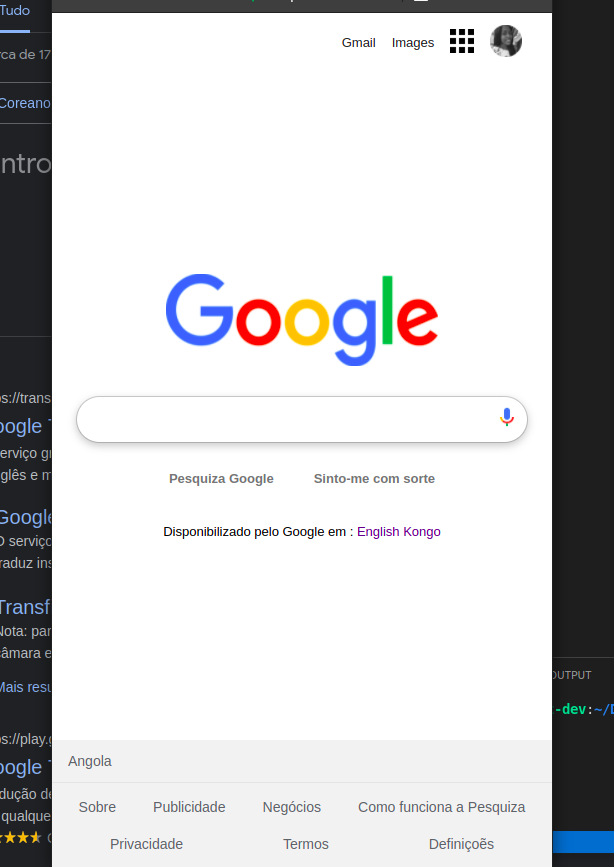
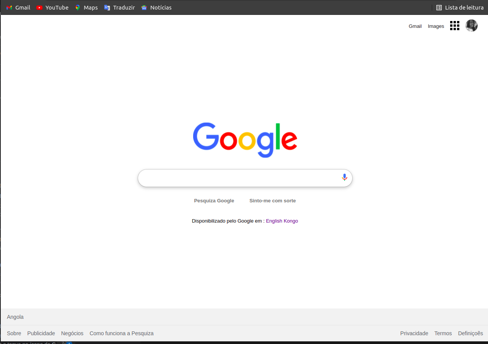

# CloneHomePage-Googgle
## Desafio CDA Girls

Sugerido pela Juliana Soba, uma das embaixadoras da CDA Girls

## Detalhes
Clonagem da página Home da Google usando as tecnologias HTML e CSS!

##Ferramentas
1. Vscode
2. Git e GitHub

Imagens da telas

OBS: sem esquecer de um video curto, onde eu explico como eu fiz, o clone!

## Obrigada pela visita >_<

 
  
   
   
